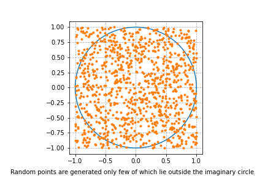
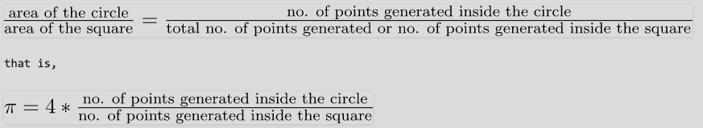

<h1 align="center">Exercises</h1>

## Exercise 1: Sum of the square roots using MPI

- Load modules `OpenMPI/4.0.3-GCC-9.3.0` and `Python/3.8.2-GCCcore-9.3.0`
- Run the code below on varying the number of cores (from 1 to 128 cores) and plot the CPU time (s) over the number of cores. 
- Create a shell script that generates automatically SLURM batch scripts.

```python
from mpi4py import MPI
import numpy as np

def sum_of_square_root(start, end):
    total = 0
    for i in range(start, end + 1):
        total += np.sqrt(i ** 2)
    return total

# Initialize MPI
comm = MPI.COMM_WORLD
rank = comm.Get_rank()
size = comm.Get_size()

# Define the range of values to sum for each process
N = 100000  # Replace with your desired value of N

local_start = 1 + rank * (N // size)
local_end = local_start + (N // size) - 1
if rank == size - 1:
    local_end += N % size  # Distribute the remainder


ts=MPI.Wtime()
# Calculate the sum of square root locally
local_result = sum_of_square_root(local_start, local_end)
te=MPI.Wtime()

max_cpu = comm.reduce(te-ts, op=MPI.MAX,root=0)
if rank == 0:
    print("cpu time is: ", max_cpu)

# Gather results from all processes
total_result = comm.reduce(local_result, op=MPI.SUM, root=0)

# Print the result from the root process
if rank == 0:
    print(f"The sum of squares from 1 to {N} is: {total_result}")
```

## Exercise 2: Computing Pi using Monte Carlo

- Monte Carlo methods are a broad class of computational algorithms that rely on repeated random sampling to obtain numerical results. 
- One of the basic examples of getting started with the Monte Carlo algorithm is the estimation of Pi.

### Estimation of Pi
- The idea is to simulate random (x, y) points in a 2-D plane with domain as a square of side 1 unit. 
- Imagine a circle inside the same domain with same diameter and inscribed into the square. 
- We then calculate the ratio of number points that lied inside the circle and total number of generated points. 
- Refer to the image below:



We know that area of the square is 1 unit sq while that of circle is $\pi \ast  (\frac{1}{2})^{2} = \frac{\pi}{4}$. Now for a very large number of generated points,




### The Algorithm

1. Initialize circle_points, square_points and interval to 0.
2. Generate random point x.
3. Generate random point y.
4. Calculate d = x*x + y*y.
5. If d <= 1, increment circle_points.
6. Increment square_points.
7. Increment interval.
8. If increment < NO_OF_ITERATIONS, repeat from 2.
9. Calculate pi = 4*(circle_points/square_points).
10. Terminate.

### Questions

- Load modules `OpenMPI/4.0.3-GCC-9.3.0` and `Python/3.8.2-GCCcore-9.3.0`
- Write a unique SLURM batch file to run the code below, with different `total_points` (e.g. 1000,10000,100000,1000000) and with different number of cores (e.g. 1, 2, 4, 8).

```python
from mpi4py import MPI
import random

random.seed(42)

# Initialize MPI                                                                                                                                                                                            
comm = MPI.COMM_WORLD
rank = comm.Get_rank()
size = comm.Get_size()


# Total number of points to generate                                                                                                                                                                        
import sys
total_points = int(sys.argv[1])

# Number of points in the circle                                                                                                                                                                            
points_in_circle = 0

# Generate random points and perform local calculation                                                                                                                                                      
local_points = total_points // size


ts=MPI.Wtime()
for _ in range(local_points):
    x = random.uniform(0, 1)
    y = random.uniform(0, 1)
    if x**2 + y**2 <= 1:
        points_in_circle += 1
te=MPI.Wtime()

max_cpu = comm.reduce(te-ts, op=MPI.MAX,root=0)

if rank == 0:
    print("With", total_points, "samples, the cpu time using", size, "core(s) is: ", max_cpu)


# Reduce the number of points in the circle from all processes                                                                                                                                              
total_points_in_circle = comm.reduce(points_in_circle, op=MPI.SUM, root=0)

if rank == 0:
    # Calcule Pi en utilisant le résultat global                                                                                                                                                            
    pi_approximation = 4.0 * total_points_in_circle / total_points
    print(f"Approximation de Pi: {pi_approximation}")
```

## Exercise 3:  Matrix multiplication using CPU vs GPU
- Load modules `Python/3.8.2-GCCcore-9.3.0` and `CUDA/11.1.1`
- Write SLURM script to run the code below, and compare the cpu time using different sizes of the matrix A and B.

```python
from numba import cuda, njit
import numpy
import math
import timeit
import cupy


@njit
def mxm_dense_numba(A, B, C):
    """Perform matrix multiplication C = A * B"""
    rows, cols = A.shape[0], B.shape[1]

    for i in range(rows):
        for j in range(cols):
            tmp = 0.0
            for k in range(A.shape[1]):
                tmp += A[i, k] * B[k, j]
            C[i, j] = tmp

# CUDA kernel
@cuda.jit
def mxm_dense_cuda(A, B, C):
    """Perform matrix multiplication of C = A * B
    """
    row, col = cuda.grid(2)
    if row < C.shape[0] and col < C.shape[1]:
        tmp = 0.
        for k in range(A.shape[1]):
            tmp += A[row, k] * B[k, col]
        C[row, col] = tmp

n = 1000
A = cupy.full((n, n), 3, cupy.float64) # matrix containing all 3's                                                                                                                                  
B = cupy.full((n, n), 4, cupy.float64) # matrix containing all 4's                                                                                                                                   
C = cupy.zeros((n, n), dtype=cupy.float32)

# Configure the blocks
# Set up the CUDA grid dimensions

nb = 16
threadsperblock = (nb, nb)
blockspergrid_x = (A.shape[0] + threadsperblock[0] - 1) // threadsperblock[0]
blockspergrid_y = (B.shape[1] + threadsperblock[1] - 1) // threadsperblock[1]
blockspergrid = (blockspergrid_x, blockspergrid_y)

mxm_dense_cuda[blockspergrid, threadsperblock](A, B, C)
ts = timeit.default_timer()
# Start the kernel 
mxm_dense_cuda[blockspergrid, threadsperblock](A, B, C)
te = timeit.default_timer()
print("With dense GPU", te - ts)


A = numpy.full((n, n), 3, cupy.float64) # matrix containing all 3's                                                                                                                                  
B = numpy.full((n, n), 4, cupy.float64) # matrix containing all 4's                                                                                                                                   
C = numpy.zeros((n, n), dtype=cupy.float32)


mxm_dense_numba(A, B, C)
ts = timeit.default_timer()
# Start the kernel                                                                                                                                                                                          mxm_dense_numba(A, B, C)
te = timeit.default_timer()
print("With dense CPU", te - ts)
```

